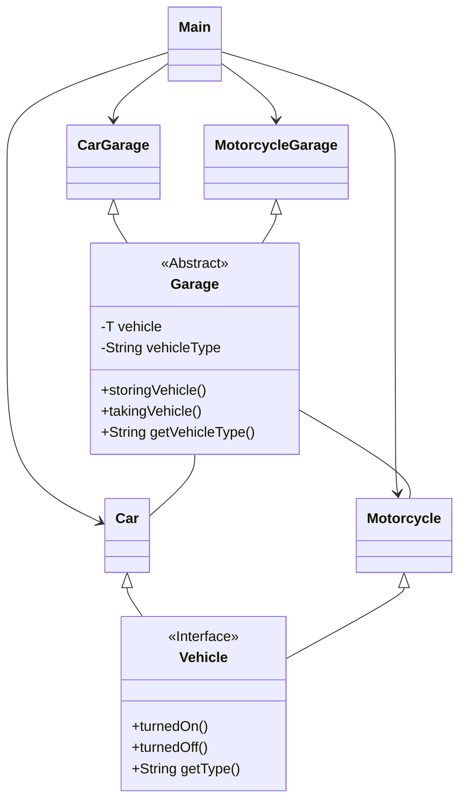

# Desafio DIO Bootcamp, Criando projetos com padrões GoF
Desafio, criar uma solução que explore o cenceito de Padrões de Projeto:

- [X] Java Puro (GoF)
- [ ] Spring Framework

Bom, escolhi o Java Puro porque gosto de lógica e fazer acontecer, uso o Spring quando é preciso, quando é para escolher, claro, escolho a linguagem pura, como neste caso... sem mais delongas vamos para o projeto.

# Projeto

Desenvolvi classes de veículos e garagens para tipos de veículos específicos; se for colocado, por exemplo, uma moto na garagem para carros ocorrerá uma exception, bom, neste momento não criei uma classe exception para especificar a excessão e fazer o tratamento, pois o objetivo do desafio é apresentar os Padrões de Projetos.

## Padrões de Design do GoF

1. ### Strategy Pattern:
   + O padrão Strategy é utilizado para definir uma família de algoritmos, encapsulá-los e torná-los intercambiáveis. Neste projeto, as classes `Car` e `Motorcycle` implementam a interface `Vehicle`, definindo comportamentos específicos para cada tipo de veículo. Embora o comportamento de direção seja similar, o padrão é sugerido aqui pela forma como diferentes tipos de veículos são tratados, permitindo que novos tipos de veículos possam ser adicionados facilmente sem modificar as classes existentes.

2. ### Factory Method (implícito):
   + Factory Method Implícito refere-se a situações em que a criação de objetos é controlada por métodos que não são explicitamente chamados de "factory" ou que não seguem rigorosamente a forma tradicional do padrão. Embora não esteja explicitamente implementado, o uso da classe abstrata `Garage` sugere um padrão de fábrica, onde subclasses específicas (`CarGarage`, `MotorcycleGarage`) podem ser criadas para instanciar e gerenciar tipos específicos de veículos.

3. ### Template Method:
   + Template Method é um padrão de design comportamental que define o esqueleto de um algoritmo em um método, permitindo que subclasses alterem etapas específicas do algoritmo sem mudar sua estrutura. A classe `Garage` define um esqueleto de métodos para armazenar e retirar veículos (`storingVehicle` e `takingVehicle`), com as subclasses podendo definir detalhes específicos. Isso permite que o comportamento geral seja definido na classe base, enquanto os detalhes são especificados nas subclasses.

##  Princípios de Programação Orientada a Objetos (POO)

1. ### Encapsulamento:
   + As classes encapsulam dados e métodos relacionados. Por exemplo, `Car` e `Motorcycle` encapsulam os métodos específicos para ligar, desligar e dirigir o veículo, enquanto a classe `Garage` gerencia a lógica de armazenamento de veículos.

2. ### Polimorfismo:
   + O uso da interface `Vehicle` permite que diferentes tipos de veículos (`Car`, `Motorcycle`) sejam tratados de forma polimórfica, o que é um exemplo claro de polimorfismo em ação.

3. ### Herança:
   + A herança é usada entre `Garage` e suas subclasses (`CarGarage` e `MotorcycleGarage`). Isso permite que as subclasses herdem comportamentos comuns, como armazenamento e retirada de veículos, enquanto adicionam ou modificam funcionalidades específicas para o tipo de veículo que gerenciam.

4. ### Abstração:
   + A interface `Vehicle` define um contrato abstrato para todos os tipos de veículos, enquanto as classes concretas (`Car`, `Motorcycle`) implementam esses métodos, escondendo os detalhes de implementação.

## Diagrama UML

