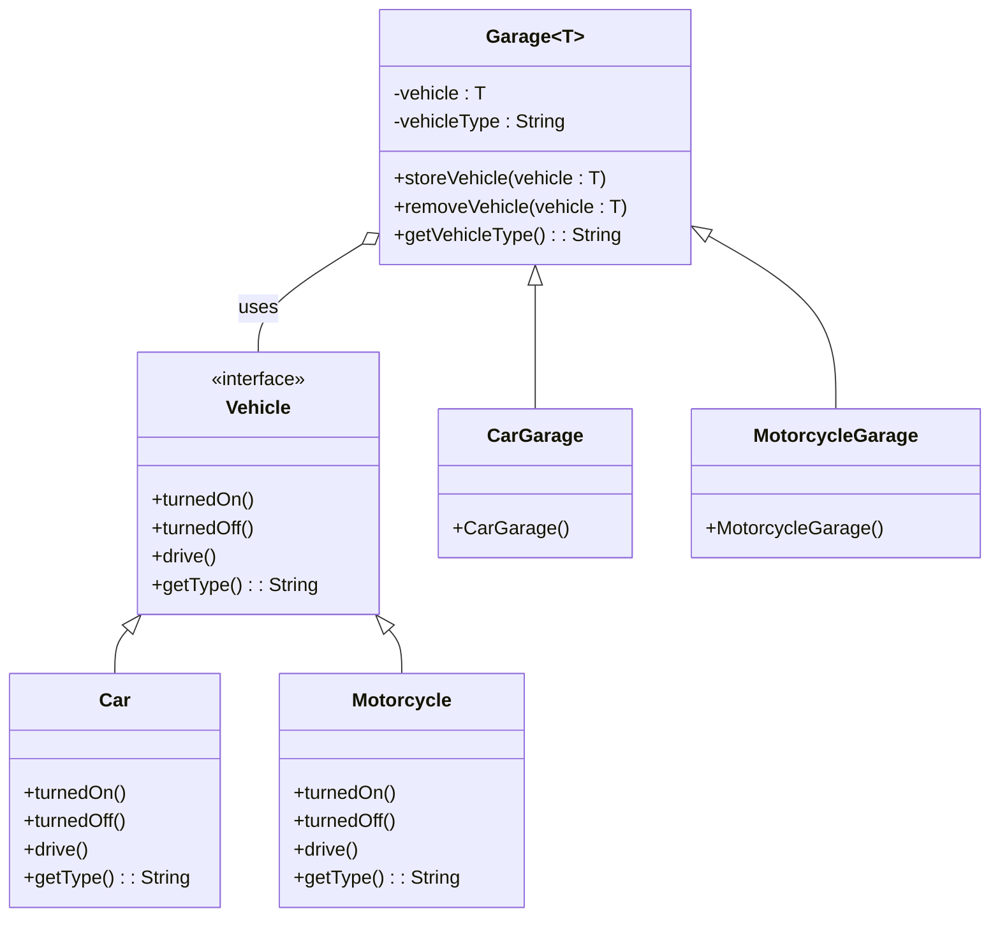

# Desafio DIO Bootcamp, Criando projetos com padrões GoF
Desafio, criar uma solução que explore o cenceito de Padrões de Projeto:

- [X] Java Puro (GoF)
- [ ] Spring Framework

Bom, escolhi o Java Puro porque gosto de lógica e fazer acontecer, uso o Spring quando é preciso, quando é para escolher, claro, escolho a linguagem pura, como neste caso... sem mais delongas vamos para o projeto.

# Projeto

Neste projeto foi criado uma aplicação que simula um mundo virtual em que tenha (somente, rsrsrsr) veículos e garagens e, que os veículos tenha somente funções básicas e as garagens aceite somente um tipo de veículo. A princípio, os veículos armazena um veículo apenas, kkkk, bom, o objetivo do projeto é apresentar os Padrões de Projetos.

## Padrões de Design do GoF[^1]

1. ### Strategy Pattern[^2]:
   + Neste projeto, as classes `Car` e `Motorcycle` implementam a interface `Vehicle`, definindo comportamentos específicos para cada tipo de veículo. Embora o comportamento de direção seja similar, o padrão é sugerido aqui pela forma como diferentes tipos de veículos são tratados, permitindo que novos tipos de veículos possam ser adicionados facilmente sem modificar as classes existentes.

2. ### Factory Method (implícito)[^3]:
   + Embora não esteja explicitamente implementado, o uso da classe abstrata `Garage` sugere um padrão de fábrica, onde subclasses específicas (`CarGarage`, `MotorcycleGarage`) podem ser criadas para instanciar e gerenciar tipos específicos de veículos.

3. ### Template Method[^4]:
   + A classe `Garage` define um esqueleto de métodos para armazenar e retirar veículos (`storingVehicle` e `takingVehicle`), com as subclasses podendo definir detalhes específicos. Isso permite que o comportamento geral seja definido na classe base, enquanto os detalhes são especificados nas subclasses.

##  Princípios de Programação Orientada a Objetos (POO)[^5]

1. ### Encapsulamento[^6]:
   + As classes `Car` e `Motorcycle` encapsulam os métodos específicos para ligar, desligar e dirigir o veículo, enquanto a classe `Garage` gerencia a lógica de armazenamento de veículos.

2. ### Polimorfismo[^7]:
   + O uso da interface `Vehicle` permite que diferentes tipos de veículos (`Car`, `Motorcycle`) sejam tratados de forma polimórfica, o que é um exemplo claro de polimorfismo em ação.

3. ### Herança[^8]:
   + A herança é usada entre `Garage` e suas subclasses (`CarGarage` e `MotorcycleGarage`). Isso permite que as subclasses herdem comportamentos comuns, como armazenamento e retirada de veículos, enquanto adicionam ou modificam funcionalidades específicas para o tipo de veículo que gerenciam.

4. ### Abstração[^9]:
   + A interface `Vehicle` define um contrato abstrato para todos os tipos de veículos, enquanto as classes concretas (`Car`, `Motorcycle`) implementam esses métodos, escondendo os detalhes de implementação.

## Diagrama UML

[^1]: Padrões de Design do GoF (Gang of Four) são uma coleção de soluções típicas para problemas comuns de design de software. Esses padrões foram documentados e popularizados por quatro autores—Erich Gamma, Richard Helm, Ralph Johnson e John Vlissides—no livro "Design Patterns: Elements of Reusable Object-Oriented Software", publicado em 1994. O grupo é conhecido como "Gang of Four" ou "GoF".
[^2]: O padrão Strategy é utilizado para definir uma família de algoritmos, encapsulá-los e torná-los intercambiáveis.
[^3]: Factory Method Implícito refere-se a situações em que a criação de objetos é controlada por métodos que não são explicitamente chamados de "factory" ou que não seguem rigorosamente a forma tradicional do padrão.
[^4]: Template Method é um padrão de design comportamental que define o esqueleto de um algoritmo em um método, permitindo que subclasses alterem etapas específicas do algoritmo sem mudar sua estrutura.
[^5]: POO é um paradigma de programação que organiza o software em objetos, que são instâncias de classes. Uma classe define uma estrutura de dados (atributos) e comportamentos (métodos) que os objetos daquela classe podem ter. POO facilita a modelagem de sistemas complexos usando conceitos do mundo real e promove uma abordagem modular e reutilizável para o desenvolvimento de software.
[^6]: O Encapsulamento restringe o acesso direto aos atributos de um objeto e controla como esses atributos são manipulados. Isso protege o estado interno do objeto e melhora a segurança e a integridade dos dados.
[^7]: A Herança permite criar novas classes a partir de classes existentes, herdando seus atributos e métodos, o que promove a reutilização de código e a criação de hierarquias de classes.
[^8]: O Polimorfismo permite que objetos de diferentes classes sejam tratados como objetos de uma classe comum. Isso facilita a utilização de diferentes tipos de objetos de maneira uniforme e intercambiável.
[^9]: A Abstração foca em expor apenas os aspectos essenciais de um objeto ou classe, escondendo detalhes complexos e promovendo interfaces claras e concisas.
